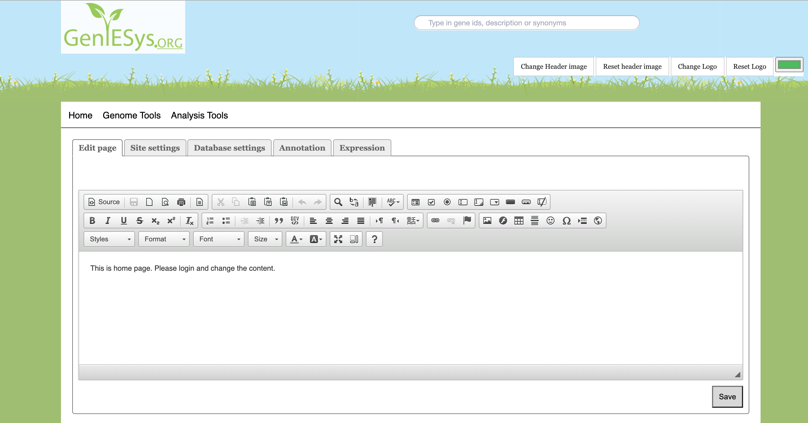
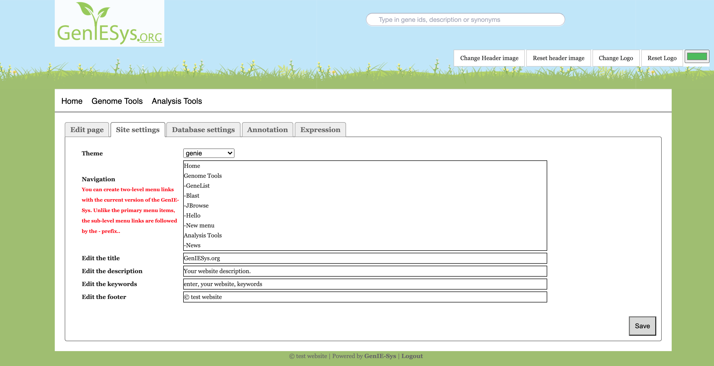

# Customisation

Now you can be able to access the newly setup GenIE-Sys website by navigating to http://localhost/geniesys URL. Here we are going to customise the basic site settings.

Basic installation of GenIE-Sys looks like following.

Now we need to login to the system using login link \([http://localhost/geniesys/?login](http://localhost/geniesys/?login)\) at the bottom of the page. admin in the default password for the login. We recommend you to change the default password with strong password. Login screen looks like the following.

Current version of admin page looks similar to the following screenshot. In the Edit page tab we can be able to change the content of the respective page. First we need to navigate to the correct page. Then edit the content and save. There are few buttons on the top right corner of the website where you can change the header image, logo or background color.

Site setting tab contains all the site settings such as menu links, theme selection and basic settings.

