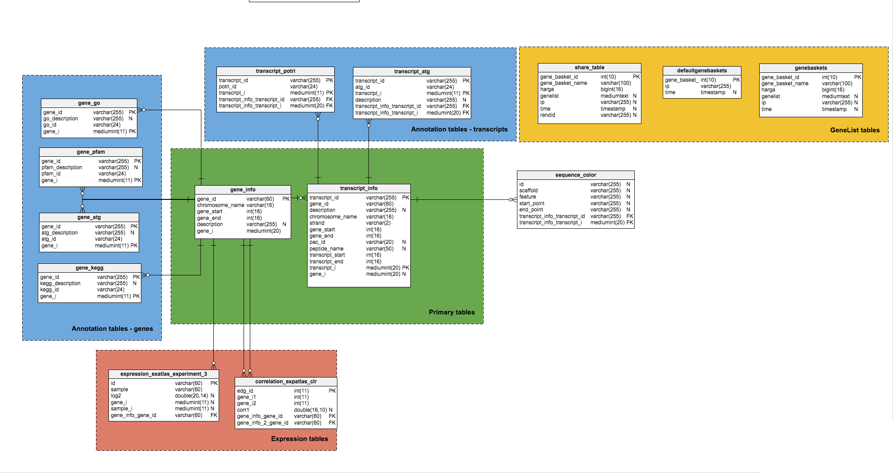

# Database design

GenIE-Sys has its basic content stored in text files. MySQL database server is required to load the genomic data and integrate with GenIE-Sys plugins.

**Loading tables**

Following database diagram shows the initial genie database architecture. It will be used with basic geniesys tools such as GeneList, gene information pages, autocomlete search and BLAST.

We have to to follow the [data loading](https://geniesys.readthedocs.io/en/latest/plugins/genelist.html) instructions in order to load data into the database tables.

**Configuring genome database**

All configuration settings in geniesys need to be added into `/geniesys/plugins/settings.php` file. You need to update `/geniesys/plugins/settings.php` file with your available details. You can find everything about the integration plugins and how to load data in the plugins section.

