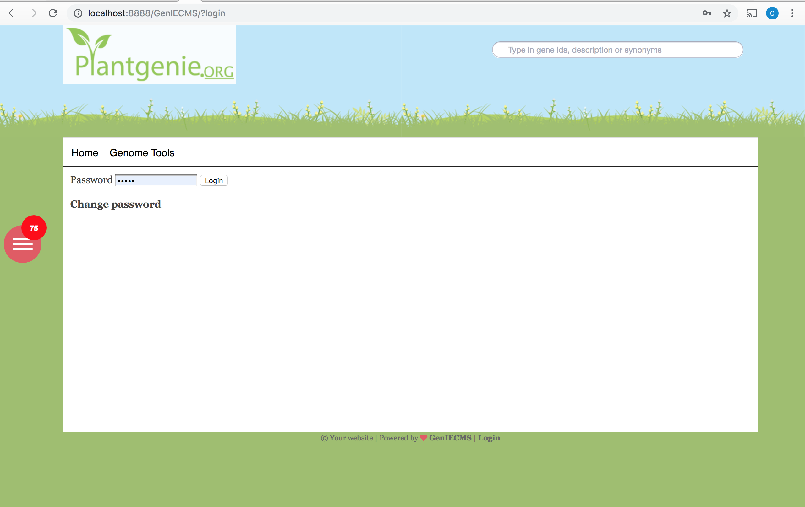
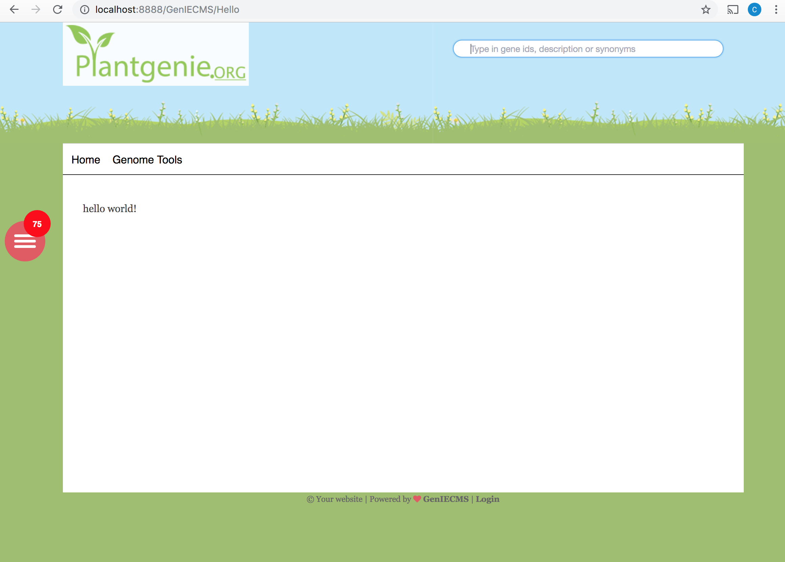

# How to create a plugin?

GenIE-Sys plugin can start as a simple file with a PHP function. All plugins are being installed in `/geniesys/plugins`. The only requirement for a plugin is that the folder name has to be the same as the menu name and `index.php` file should be available inside the plugin folder to initialize the plugin.

```text
/geniesys/plugins/{pluginname}/index.php
/geniesys/plugins/{pluginname}/tool.php
```

**Hello World! Plugin**

```text
/geniesys/plugins/hello/tool.php
```

1. Creat hello directory inside the plugin directory
2. Place following index.php file inside hello directory

```text
<?php
//index.php
$subdir_arr = explode("/", $_SERVER['REDIRECT_URL']);
$mennu_arr = explode("<br />", $c['menu']);
$menu_exist = false;
for ($search_num = 0; $search_num < count($mennu_arr); $search_num++) {  
    if (trim(strtolower($mennu_arr[$search_num])) == strtolower($subdir_arr[count($subdir_arr) - 1]) ||      
    trim(strtolower($mennu_arr[$search_num])) == "-".strtolower($subdir_arr[count($subdir_arr) - 1])) {  
        $menu_exist = true;
    }
}
if(strtolower(basename(dirname(__FILE__)))== strtolower($subdir_arr[count($subdir_arr)-1]) && $menu_exist==true){
    $c['initialize_tool_plugin'] = true;
    $c['tool_plugin'] = strtolower($subdir_arr[count($subdir_arr) - 1]);
}
?>
```

3.\) Add tool.php into the hello\_world directory. `tool.php` file will be used to write all the function related to the plugin.

```text
<?php
//tool.php
echo "Hello World!";
?>
```

4.\) Log into the system and add hello into the menu like shown in following figure.



5.\) Navigate to `http://[server name]/geniesys/hello`



More details about the GenIE-Sys API is available on [https://api.plantgenie.org](https://api.plantgenie.org)

