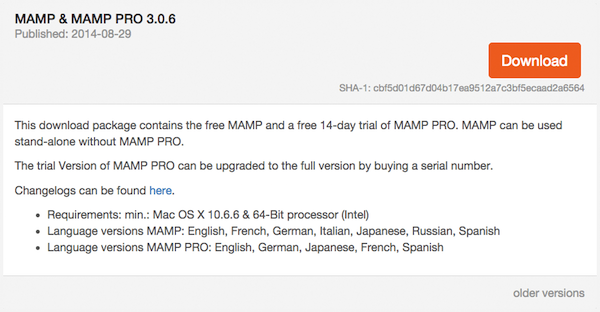
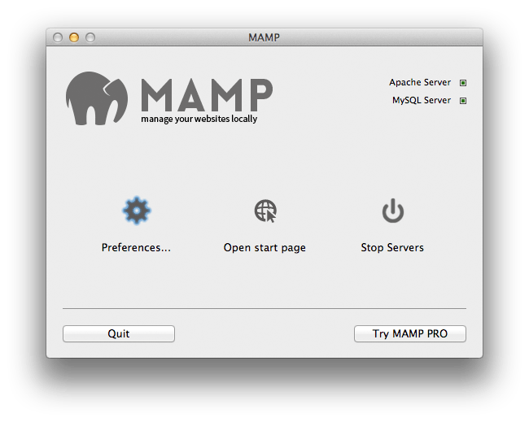
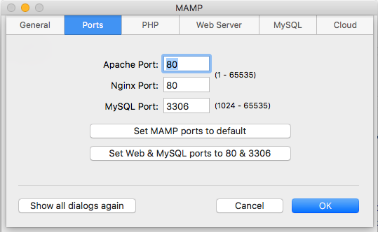

# Installation

GenIE-Sys can be installed in a few different methods as below.



[Docker](https://www.docker.com/) is a software that provides the ability to package and run an application in an isolated environment called a container. Open the terminal and use following commands.

```text
# With docker-compose 
git clone https://github.com/irusri/docker4geniesys.git  
cd docker4geniesys  
docker-compose up
```

                                                                              **OR**

```text
# Without docker-compose 
git clone https://github.com/irusri/docker4geniesys.git  
cd docker4geniesys  
docker build -t genie -f ./Dockerfile .  
docker run --rm -i -t -p "80:80" -p "3308:3306" -v ${PWD}/genie:/app -v ${PWD}/mysql:/var/lib/mysql -e MYSQL_ADMIN_PASS="mypass" --name genie genie  
cd genie 
```

👍 Now you can access the GenIE-Sys on [http://localhost/geniesys/](http://localhost/geniesys/) URL.

You can access MySQL database using `mysql -u admin -pmypass -h localhost -P 3308` or using [phpMyAdmin](http://localhost/phpmyadmin). Some useful docker commands are as follows. As you may noticed here `admin` is the default MySQL username and `mypass` is the default  password. You can change that in `docker-compose.yml file.`

If you running on production environment, we recommend changing the password for MySQL user.



[MAMP](https://www.mamp.info/) is a solution stack composed of [Apache](https://httpd.apache.org/), [MySQL](https://www.mysql.com/) and [PHP](https://www.php.net/) used together to develop and run dynamic web sites on computers.



Installing MAMP is just a matter of downloading the app from the MAMP website and running the installer. It will install a MAMP app in your Applications folder.



By starting the MAMP app you are also starting your Apache and MySQL server. You should now be able to reach your local server at `http://localhost:8888`.

By default, MAMP uses port 8888 for Apache and port 8889 for MySQL. It is convenient to change the MySQL and Apache ports to 3306 and 80 respectively to use default MySQL and Apache ports.



**Download GenIE-Sys**

[](https://github.com/irusri/geniesys/archive/master.zip)

**Copy GenIE-Sys to MAMP Webserver**

You will find the source of GenIE-Sys in your download folder. So you just need to Copy GenIE-Sys folder into the corresponding `~/Applications/MAMP/htdocs/` folder.

That is basically what you need to do in order to install GenIE-Sys on your Mac’s local server. You should now be able to access it at: `http://localhost:[port number]/geniesys` in your browser. Now you can see the essential website up and running. However to configure it correctly please update the configuration file as described in the next section.




When you use standalone web server installation with MAMP, you have to make sure to install and configure all required software and packages that are necessary for different plugins. Required packages listed [here](requirements.md).


 All good, next we need to customise our new website and load our genome into the database.

