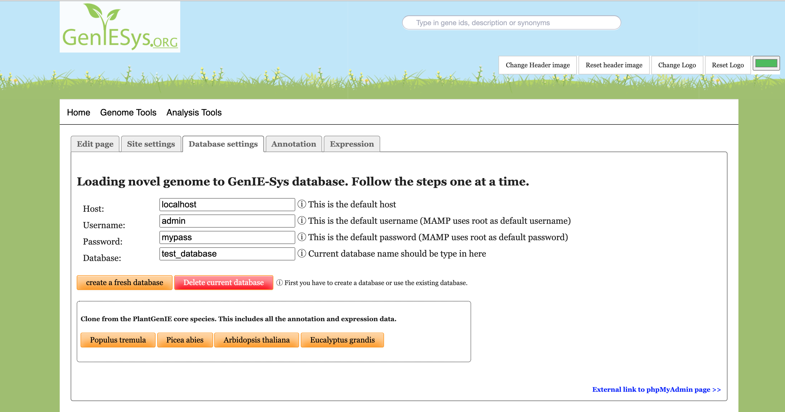

# Loading dummy data

Once you logged in to the GenIE-Sys web interface there is a tab called Database settings where we can find a tab similar to the following screenshot.

When you did the GenIE-Sys installation using Docker image, the defaults username and password for MySQL server will be. 

username : admin  
password: mypass \(You can change this password using `docker-compose.yml.`\)

When you did your installation using MAMP server, ther default username and password for MySQL server will be.

username: root  
password: root  
  
Now you can create a empty database or create a clone from core species databases. There is also link to view the database in more detail using PHPMyAdmin.  

