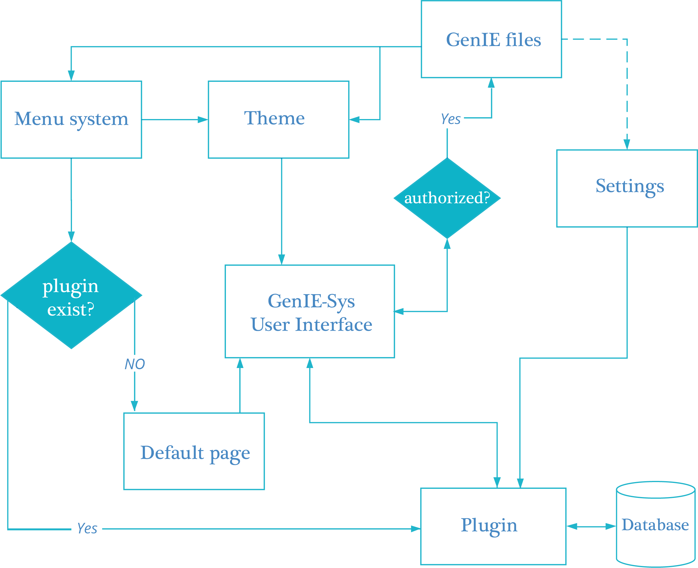

# Plugin architecture

## Plugin architecture

GenIE-Sys comes with a stable but yet simple-to-start plugin architecture. A plugin is a simple folder with a bunch of PHP files. This would be the simplest form:

```text
site/plugins/my-plugin/index.php
```

GenIE-Sys automatically loads all plugins from folders within `/site/plugins` and tries to find an `index.php`.

Analysis, expression or genomic tools \([Sundell et al., 2015](https://nph.onlinelibrary.wiley.com/doi/full/10.1111/nph.13557)\) are integreated into a GenIE-Sys as external plugins. GenIE-Sys contains JBrowse, GeneList, gene information pages and BLAST as standard default plugins. All additional tools \(exImage, exNet, Enrichment\) can be integrated as external plugins to the GenIE-Sys.



As shown in the above figure. Genie files can be changed by the administrator using GenIE-Sys user interface. Basic site configurations including passwords, menus and themes information stored in the GenIE files. First, check the availability of the plugin for the given menu name. If the plugin is available for the given menu name, the equivalent plugin will be displayed; otherwise, the user will only see the default blank page. Plugins will use the Database and storage files to visualize genomic, analysis and expression data. The corresponding plugin will render inside the GenIE user interface with the combination of the selected theme. The plugin will also have access to the settings files to get database name, username, password, blast directories and other similar settings. Settings have to access the configuration files to get default database name unless if it’s not already mentioned in the settings files.

